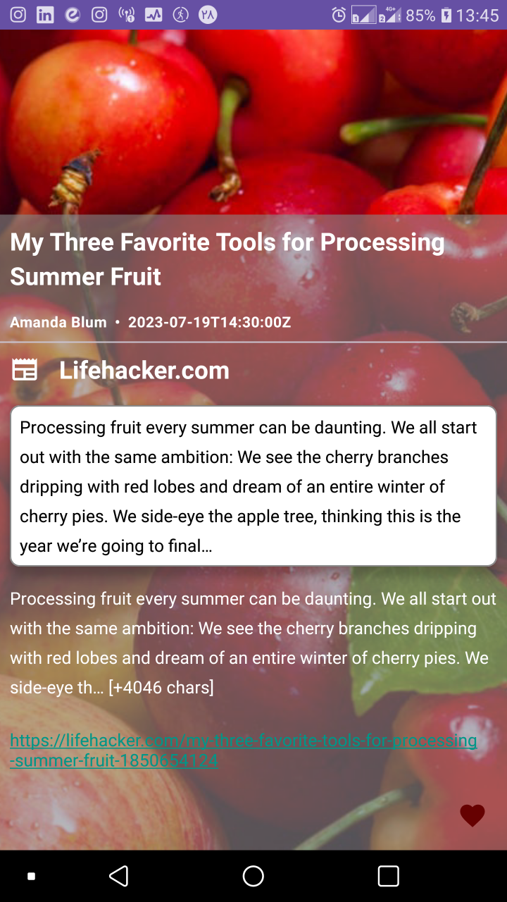

# About
- This repository is about searching on news articles by calling API. After getting result, user could make favorite article list.

# Language
- Kotlin

# Architecture
- Clean Architecture
- MVVM pattern
- SOLID principals

# Main Features:
- Searching on news articles
- Pagination list
- Make a favorite list of news articles

This sample showcases:
* JetPack Compose
* Material3 Theme
* Coroutines
* Hilt
* Retrofit
* ORM (ROOM)
* Navigation Component
* Glide

## Screenshots

## Features

#### [Onboarding Screen](app/src/main/java/com/example/owl/ui/onboarding)
The onboarding screen allows users to customize their experience by selecting topics. Notable features:
* Custom [staggered grid layout](app/src/main/java/com/example/owl/ui/onboarding/Onboarding.kt#L239).
* [Topic chip](app/src/main/java/com/example/owl/ui/onboarding/Onboarding.kt#L171) with custom [selection animation](app/src/main/java/com/example/owl/ui/onboarding/Onboarding.kt#L157).

#### [Search Screen](app/src/main/java/com/example/owl/ui/courses)
The search screen displays search result of api. Notable features:
* Custom [`StaggeredVerticalGrid`](app/src/main/java/com/example/owl/ui/courses/FeaturedCourses.kt#L161) responsive to available size.
* [`FeaturedCourse`](app/src/main/java/com/example/owl/ui/courses/FeaturedCourses.kt#L70) composable demonstrates usage of [`ConstraintLayout`](https://developer.android.com/reference/kotlin/androidx/compose/foundation/layout/package-summary.html#ConstraintLayout(androidx.compose.ui.Modifier,%20kotlin.Function1)).

#### [Course Details Screen](app/src/main/java/com/example/owl/ui/course/CourseDetails.kt)
Displays details of a selected course, featuring:

* A [FloatingActionButton](https://material.io/components/buttons-floating-action-button) that can be clicked or dragged to transform into a [`LessonsSheet`](app/src/main/java/com/example/owl/ui/course/CourseDetails.kt#L309).
* A selection of [`RelatedCourses`](app/src/main/java/com/example/owl/ui/course/CourseDetails.kt#L262) using a nested `BlueTheme`.

#### [Theming](app/src/main/java/com/example/owl/ui/theme)
Owl follows Material Design, customizing [colors](app/src/main/java/com/example/owl/ui/theme/Color.kt), [typography](app/src/main/java/com/example/owl/ui/theme/Type.kt) and [shapes](app/src/main/java/com/example/owl/ui/theme/Shape.kt). These come together in Owl's multiple [themes](app/src/main/java/com/example/owl/ui/theme/Theme.kt), one for each color scheme. Additionaly, Owl supports [image](app/src/main/java/com/example/owl/ui/theme/Images.kt) and [elevation](app/src/main/java/com/example/owl/ui/theme/Elevation.kt) theming, providing alternate images/elevations in light/dark themes.

#### [Common UI](app/src/main/java/com/example/owl/ui/common)
Compose makes it simple to create a library of components and use them throughout the app. See:
* [`CourseListItem`](app/src/main/java/com/example/owl/ui/common/CourseListItem.kt) is used on both the [My Courses](app/src/main/java/com/example/owl/ui/courses/MyCourses.kt) screen and in the related section of the [Course Details](app/src/main/java/com/example/owl/ui/course/CourseDetails.kt) screen.
* [`OutlinedAvatar`](app/src/main/java/com/example/owl/ui/common/OutlinedAvatar.kt) is used on both the [Featured Courses](app/src/main/java/com/example/owl/ui/courses/FeaturedCourses.kt) screen and the [Course Details](app/src/main/java/com/example/owl/ui/course/CourseDetails.kt) screen.

#### [Utilities](app/src/main/java/com/example/owl/ui/utils/)
Owl implements some utility functions of interest:
* [Lazy layouts](https://developer.android.com/jetpack/compose/lists) - specifically LazyColumn and LazyRow, passing [item keys](https://developer.android.com/jetpack/compose/lists#item-keys) and using [`animateItemPlacement()`](https://developer.android.com/reference/kotlin/androidx/compose/foundation/lazy/LazyItemScope#(androidx.compose.ui.Modifier).animateItemPlacement(androidx.compose.animation.core.FiniteAnimationSpec)).
* [Window insets](https://developer.android.com/reference/kotlin/androidx/compose/foundation/layout/WindowInsets) are provided by the Compose Foundation library.
* [NavGraph](app/src/main/java/com/example/owl/ui/NavGraph.kt) models navigation within the app using [Jetpack Navigation](https://developer.android.com/jetpack/compose/navigation).

